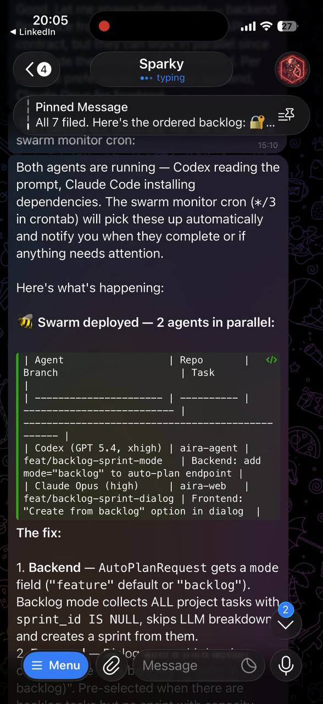
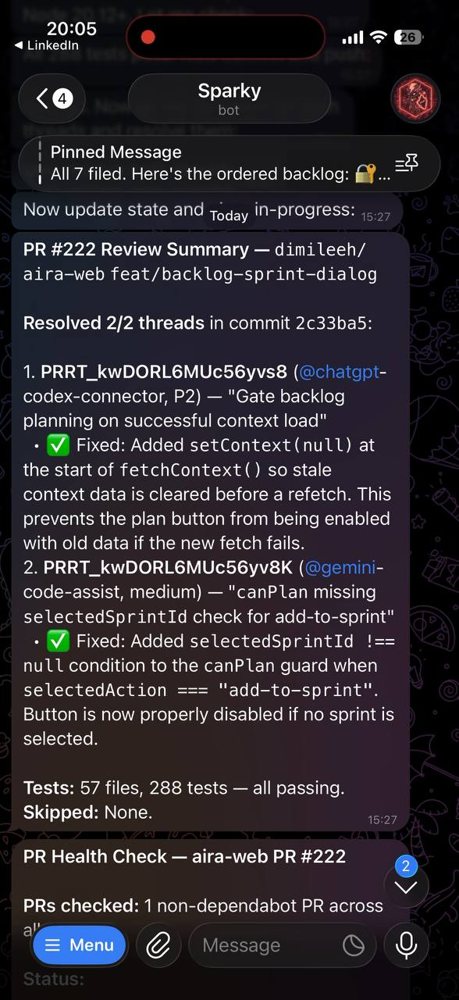
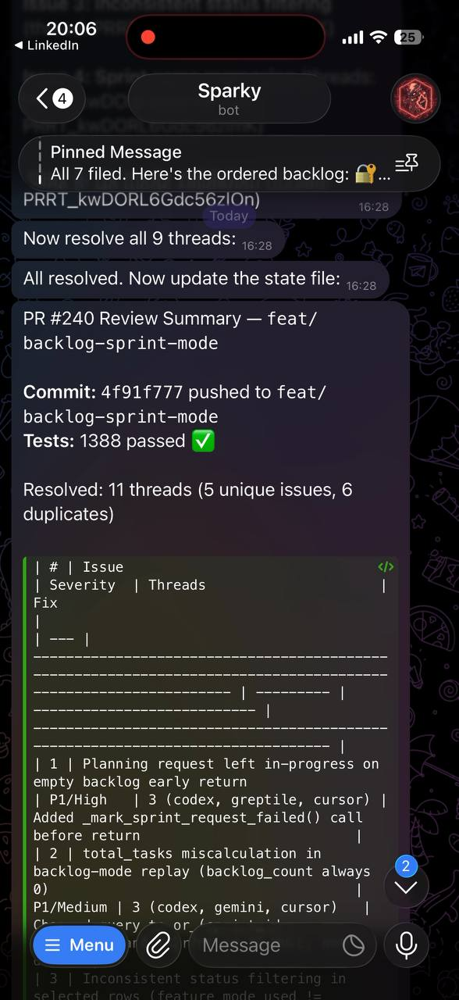
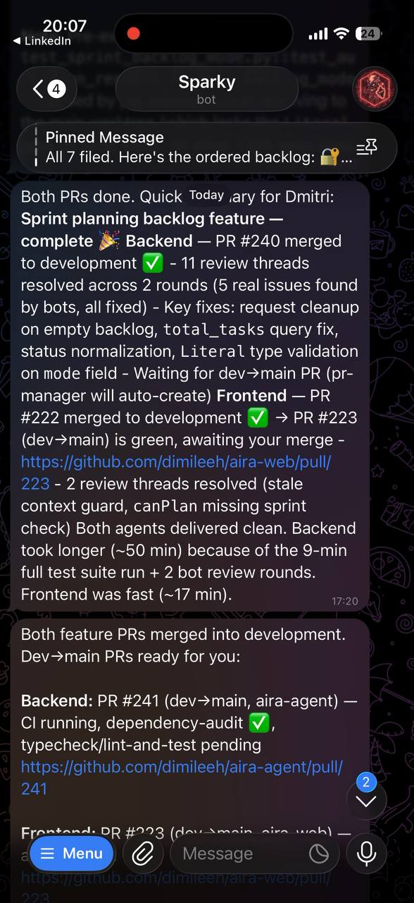

# clawdbot

AI agent swarm orchestration for production codebases.

A shell-first toolkit for spawning coding agents into isolated git worktrees, tracking their progress, automating PR reviews, and driving a safe human-in-the-loop merge loop. Zero LLM cost when idle — monitoring scripts only wake the orchestrator when something needs attention.

## How it works

```
task/prompt
   │
   ▼
spawn-agent.sh ─────────────────────────────────────┐
   │                                                 │
   ├── create worktree from integration branch       │
   ├── write prompt + inject AGENTS.md               │
   └── start agent in tmux session                   │
                                                     │
agent codes → tests → commits → pushes → opens PR   │
                                                     │
   ┌─────────────────────────────────────────────────┘
   ▼
swarm-monitor.sh (*/3 cron) ──── check-agents.sh
   │
   ├── CI failed?        → wake orchestrator to fix
   ├── PR ready?         → wake orchestrator to notify
   ├── conflict?         → wake orchestrator to rebase
   └── nothing changed?  → exit silently (zero cost)
   
pr-manager.sh (*/10 cron)
   │
   ├── auto-merge safe integration PRs
   ├── spawn review-fix agents for unresolved threads
   ├── spawn CI-fix agents for failing checks
   └── open integration→main sync PRs when queue drains

human reviews and merges main-targeted PRs
```

## In Action

<table>
  <tr>
    <td width="50%">
      
      <p align="center"><b>Swarm Deploy</b> — Codex + Claude Code spawned in parallel, each in its own worktree</p>
    </td>
    <td width="50%">
      
      <p align="center"><b>Auto Review</b> — Bot review threads resolved with fixes, all tests passing</p>
    </td>
  </tr>
  <tr>
    <td width="50%">
      
      <p align="center"><b>Review Resolution</b> — 11 threads resolved across 5 real issues, 1388 tests ✅</p>
    </td>
    <td width="50%">
      
      <p align="center"><b>Delivery</b> — Both agents done, dev→main PRs ready for human merge</p>
    </td>
  </tr>
</table>

## Prerequisites

- [OpenClaw](https://github.com/openclaw/openclaw) — installed and authenticated
- `git` — version control
- `gh` — [GitHub CLI](https://cli.github.com), authenticated with repo + PR permissions
- `tmux` — agent sessions run here
- `jq` — JSON processing
- Node.js — managed via [NVM](https://github.com/nvm-sh/nvm)
- At least one coding agent CLI:
  - [Codex CLI](https://github.com/openai/codex)
  - [Claude Code](https://docs.anthropic.com/en/docs/claude-code)
  - [Gemini CLI](https://github.com/google-gemini/gemini-cli)

## Installation

Clone directly into `~/.clawdbot` — the repo IS the runtime directory:

```bash
git clone git@github.com:YOUR_USER/clawdbot.git ~/.clawdbot
cd ~/.clawdbot
cp .env.example .env
# Edit .env with your repos, GitHub owner, paths, etc.
```

Create the runtime directories:

```bash
mkdir -p logs prompts runners memory
```

Set up crontab:

```bash
crontab -e
```

```cron
# Agent pre-check (validate GitHub API, repos accessible)
*/10 * * * * /home/YOU/.clawdbot/agent-precheck.sh >> /home/YOU/.clawdbot/logs/precheck.log 2>&1

# PR manager (merge, review-fix, sync PRs)
*/10 * * * * /home/YOU/.clawdbot/pr-manager.sh >> /home/YOU/.clawdbot/logs/pr-manager.log 2>&1

# Swarm monitor (zero-LLM, wakes orchestrator only on events)
*/3 * * * * /home/YOU/.clawdbot/swarm-monitor.sh
```

## Configuration

All config lives in `.env` (gitignored). Copy `.env.example` and fill in your values:

```bash
# Required
CLAWDBOT_REPOS="owner/backend owner/frontend"    # Space-separated repos
CLAWDBOT_GITHUB_OWNER="owner"                     # GitHub org or user
CLAWDBOT_PROJECTS_ROOT="$HOME/Projects"           # Where repos are cloned

# Branch strategy
CLAWDBOT_INTEGRATION_BRANCH="development"         # Agents target this
CLAWDBOT_MAIN_BRANCH="main"                       # Humans merge here

# Paths
CLAWDBOT_HOME="$HOME/.clawdbot"                   # This directory
CLAWDBOT_NODE_PATH="$HOME/.nvm/versions/node/v24.13.0/bin"

# Notifications (via OpenClaw)
CLAWDBOT_NOTIFY_CHANNEL="telegram"
CLAWDBOT_NOTIFY_TARGET="YOUR_CHAT_ID"

# Agent defaults
CLAWDBOT_DEFAULT_AGENT="codex"
CLAWDBOT_CODEX_MODEL="gpt-5.3-codex"
CLAWDBOT_CLAUDE_MODEL="claude-sonnet-4-6"
CLAWDBOT_GEMINI_MODEL="gemini-2.5-pro"

# Optional
CLAWDBOT_SKILLS_PATH="$CLAWDBOT_PROJECTS_ROOT/antigravity-awesome-skills/skills"
CLAWDBOT_DEPENDABOT_REPO="owner/frontend"         # Auto-merge dependabot PRs here
```

Every script sources `.env` on startup with safe fallbacks, so existing env vars also work.

## Repo layout

```
~/.clawdbot/
├── .env                  # Local config (gitignored)
├── .env.example          # Template for .env
├── AGENTS.md             # Instructions injected into every agent
├── README.md
├── LICENSE
├── spawn-agent.sh        # Spawn a coding agent in a worktree
├── check-agents.sh       # Check status of all tracked tasks
├── cleanup-task.sh       # Clean up finished task worktree
├── finalize-task.sh      # Auto-called on agent exit
├── agent-precheck.sh     # Validate GitHub API + repo access
├── github-precheck.sh    # Extended GitHub health check
│
├── pr-manager.sh         # PR automation: merge, review-fix, sync
├── swarm-monitor.sh      # Zero-LLM monitor (cron, wakes on events)
├── pr-hygiene.sh         # PR health checks and cleanup
├── pr-review-collector.sh    # Collect review comments
├── pr-unified-status.sh      # Unified PR status across repos
├── check-pr-ready.sh         # Check if PR is ready to merge
├── check-pr-reviews.sh       # Check PR review status
├── check-pr-review-debt.sh   # Track review debt
├── check-cursor-risk.sh      # Cursor Bugbot risk assessment
├── auto-resolve-praise-threads.sh  # Auto-resolve "looks good" threads
│
├── logs/                 # Cron output (gitignored)
├── prompts/              # Agent prompt files (gitignored)
├── runners/              # tmux session metadata (gitignored)
├── memory/               # Agent memory files (gitignored)
└── *.json                # State files (gitignored)
```

## Usage

### Spawn an agent

```bash
~/.clawdbot/spawn-agent.sh \
  <task-id> \
  <repo-path> \
  <branch-name> \
  <agent: codex|claude|gemini> \
  <model> \
  <thinking: low|medium|high|xhigh> \
  "<prompt>"
```

Example:

```bash
~/.clawdbot/spawn-agent.sh \
  fix-auth-bug \
  ~/Projects/my-backend \
  fix/auth-bug \
  codex \
  gpt-5.3-codex \
  xhigh \
  "Fix the auth refresh token race condition. Add tests. Open a PR against development."
```

### Check running agents

```bash
~/.clawdbot/check-agents.sh | jq .
```

Returns JSON with task IDs, statuses, PR numbers, CI state, and recommended actions.

### PR status across repos

```bash
~/.clawdbot/pr-unified-status.sh    # Overview of all open PRs
~/.clawdbot/check-pr-ready.sh       # Which PRs are ready to merge
~/.clawdbot/check-pr-review-debt.sh # Which PRs need review attention
```

### Clean up a finished task

```bash
~/.clawdbot/cleanup-task.sh <task-id>
```

Removes the worktree, deletes the branch (if merged), and removes the task from the registry.

## The review loop

Two cron jobs form the core automation:

**`swarm-monitor.sh`** (every 3 min) — Pure bash, zero LLM cost. Reads `check-agents.sh` output and only wakes the OpenClaw orchestrator when:
- A PR's CI failed and needs a fix agent
- A PR is ready for merge/review
- A branch has merge conflicts

**`pr-manager.sh`** (every 10 min) — Handles repo-wide PR lifecycle:
- Auto-merges integration PRs when CI is green and reviews are approved
- Blocks merges if a release PR (integration→main) is already open
- Spawns isolated agents to fix unresolved review threads
- Spawns agents to fix CI failures
- Opens integration→main sync PRs when the dev queue is clear
- Notifies via OpenClaw when PRs need human attention

The result: agents code, push, get reviewed, fix review feedback, and re-push — all without human involvement until the final merge to main.

## Safety rails

- **Runtime `gh` wrapper** — `spawn-agent.sh` generates a `gh` shim in a temp dir that rejects PRs not targeting the integration branch
- **Worktree isolation** — each task gets its own worktree; no cross-contamination
- **Human-only main merges** — PRs to main are never auto-merged
- **State files** — all automation state is in readable JSON files
- **Cron announces deltas** — only notifies when something changes, not on every run
- **No direct pushes to main** — enforced by convention and the gh wrapper

## Supported agents

| Agent | CLI | Default flags |
|-------|-----|---------------|
| Codex | `codex exec` | `--dangerously-bypass-approvals-and-sandbox`, configurable model + reasoning |
| Claude Code | `claude` | `--dangerously-skip-permissions`, configurable model |
| Gemini | `gemini` | `--yolo`, configurable model |

Adjust defaults in `spawn-agent.sh` or override via `.env`.

## AGENTS.md

The template instruction file injected into every agent's worktree. This is where you encode:
- Coding standards and conventions
- TDD requirements (RED→GREEN→REFACTOR)
- Git discipline (branch naming, commit messages)
- PR description format
- Testing requirements
- What NOT to do

Customize this for your team's workflow.

## Agent skills

Coding agents perform better with domain-specific knowledge. We use **[Antigravity Awesome Skills](https://github.com/sickn33/antigravity-awesome-skills)** — 883+ agentic skills for AI coding assistants.

```bash
git clone https://github.com/sickn33/antigravity-awesome-skills.git \
  "$CLAWDBOT_PROJECTS_ROOT/antigravity-awesome-skills"
```

Skills are referenced in `AGENTS.md` and loaded by agents at startup. Examples:
- `tdd-workflow` — RED→GREEN→REFACTOR cycle
- `clean-code` — naming, readability, function design
- `fastapi-pro` — async Python + FastAPI patterns
- `nextjs-best-practices` — App Router conventions
- `docker-expert` — multi-stage builds, security
- `code-reviewer` — review guidelines, security scanning

Create your own skills too — it's just a `SKILL.md` file with instructions.

Browse the full catalog: [sickn33/antigravity-awesome-skills](https://github.com/sickn33/antigravity-awesome-skills)

## Updating

Since `~/.clawdbot` is the repo itself:

```bash
cd ~/.clawdbot
git pull origin main
```

Your `.env` and state files are gitignored, so pulls are clean.

## License

MIT — see [LICENSE](LICENSE).
